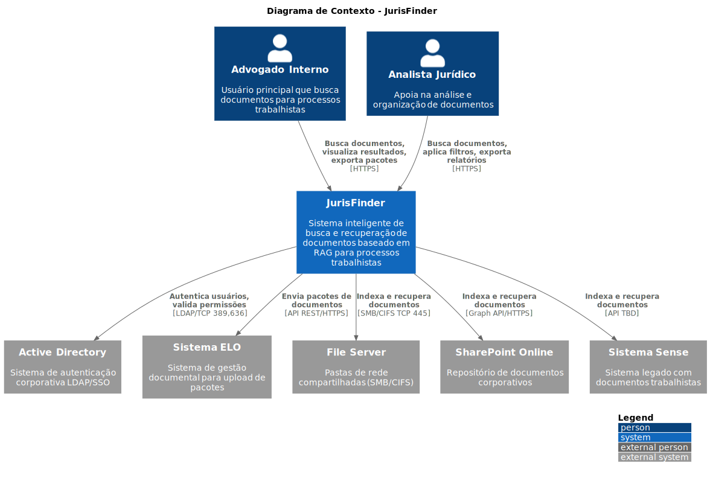
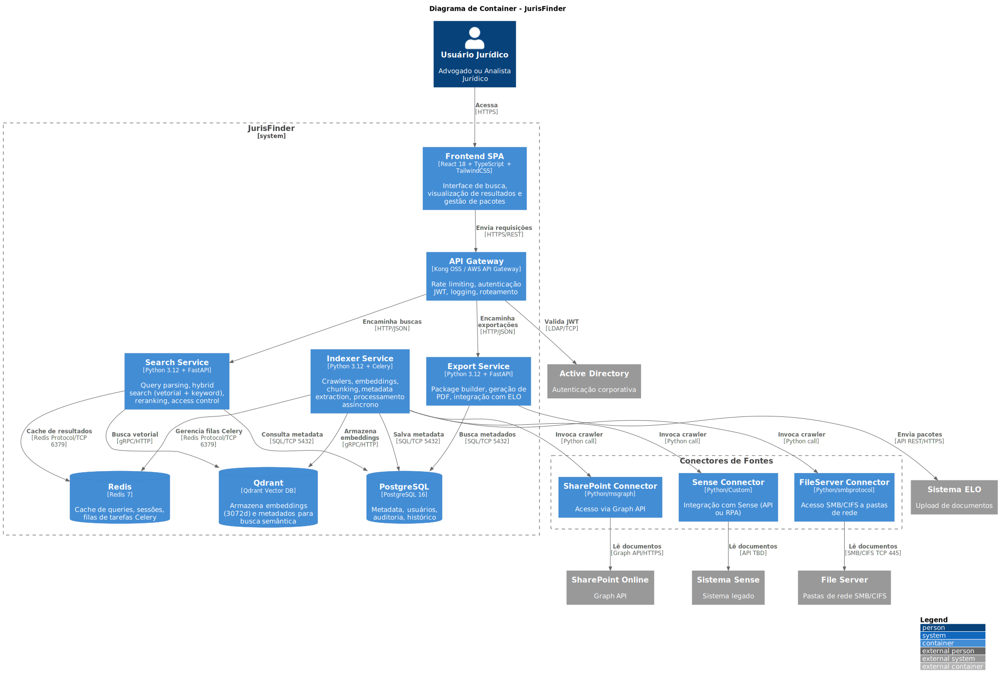
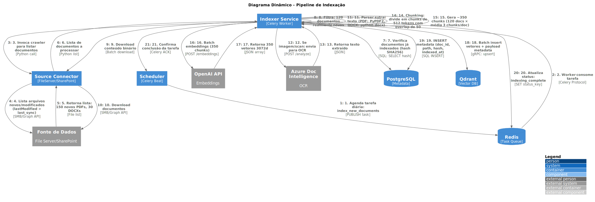

# Índice Visual de Diagramas - JurisFinder

## Diagrama de Contexto (C4 Level 1)

**Visão geral do sistema, atores e sistemas externos**

**Arquivo fonte:** [c4-context.puml](./c4-context.puml)

**Descrição:** Mostra o JurisFinder no centro com seus usuários principais (Advogado Interno e Analista Jurídico) e os sistemas externos com os quais integra (Active Directory, Sistema ELO, File Server, SharePoint Online e Sistema Sense).

---

## Diagrama de Container (C4 Level 2)

**Arquitetura de containers e serviços**

**Arquivo fonte:** [c4-container.puml](./c4-container.puml)

**Descrição:** Detalha os containers internos do JurisFinder:
- Frontend SPA (React + TypeScript)
- API Gateway (Kong)
- Search Service (Python/FastAPI)
- Indexer Service (Python/Celery)
- Export Service (Python/FastAPI)
- Data Layer (PostgreSQL, Qdrant, Redis)
- Conectores de fontes de dados

---

## Diagrama de Componentes - Search Service (C4 Level 3)

**Componentes internos do Search Service**

**Arquivo fonte:** [c4-component-search.puml](./c4-component-search.puml)

**Descrição:** Detalha a arquitetura interna do Search Service mostrando:
- Query Parser (extração de entidades)
- Query Embedder (geração de embeddings)
- Hybrid Search Engine (busca vetorial + keyword)
- Access Control Filter (validação de permissões)
- Reranker (cross-encoder)
- Result Formatter
- Cache Controller

---

## Diagrama Dinâmico - Pipeline de Busca

**Fluxo sequencial de uma busca completa**

**Arquivo fonte:** [c4-dynamic-search.puml](./c4-dynamic-search.puml)

**Descrição:** Mostra o fluxo completo de uma busca desde a digitação da query pelo usuário até a exibição dos resultados:
1. Usuário digita query natural
2. API Gateway autentica e encaminha
3. Query Parser extrai entidades
4. Query Embedder gera vetor
5. Hybrid Search combina busca vetorial + keyword
6. Access Filter valida permissões
7. Reranker reordena resultados
8. Cache salva resultado
9. Frontend exibe documentos ranqueados

---

## Diagrama Dinâmico - Pipeline de Indexação

**Fluxo sequencial de indexação de documentos**

**Arquivo fonte:** [c4-dynamic-indexing.puml](./c4-dynamic-indexing.puml)

**Descrição:** Mostra o fluxo de indexação assíncrona de documentos:
1. Scheduler agenda tarefa diária
2. Worker consome tarefa da fila
3. Crawler lista documentos novos/modificados
4. Parser extrai texto (com OCR se necessário)
5. Chunking divide em pedaços de 512 tokens
6. Embeddings gera vetores 3072d
7. Indexing armazena em Qdrant
8. Metadata salva em PostgreSQL

---

## Diagrama de Deployment

**Infraestrutura e deployment em Azure**

**Arquivo fonte:** [c4-deployment.puml](./c4-deployment.puml)

**Descrição:** Mostra a infraestrutura de produção:
- **Azure Cloud:**
  - AKS Cluster (3 nodes para app, 2 para workers)
  - PostgreSQL Managed (4 vCPU, 16GB, 500GB)
  - Redis Managed (4GB)
  - Blob Storage (1TB)
- **Qdrant Cloud:** Cluster com 2M vetores, 3 réplicas
- **ThyssenKrupp Corporate:** Active Directory, File Server, Sistema ELO
- **Conectividade:** VPN/ExpressRoute para rede corporativa
- **Externos:** SharePoint Online, OpenAI API

---

## Navegação Rápida

| Diagrama | Nível | Foco | Arquivo |
|----------|-------|------|---------|
| **Contexto** | L1 | Visão geral, atores, sistemas | [c4-context.puml](./c4-context.puml) |
| **Container** | L2 | Serviços, bancos, conectores | [c4-container.puml](./c4-container.puml) |
| **Componentes** | L3 | Internals do Search Service | [c4-component-search.puml](./c4-component-search.puml) |
| **Dinâmico - Busca** | Fluxo | Pipeline de busca completo | [c4-dynamic-search.puml](./c4-dynamic-search.puml) |
| **Dinâmico - Indexação** | Fluxo | Pipeline de indexação | [c4-dynamic-indexing.puml](./c4-dynamic-indexing.puml) |
| **Deployment** | Infra | Infraestrutura Azure + híbrida | [c4-deployment.puml](./c4-deployment.puml) |

---

## Stack Tecnológica Resumida

| Camada | Tecnologia |
|--------|------------|
| **Frontend** | React 18 + TypeScript + TailwindCSS |
| **API Gateway** | Kong OSS / AWS API Gateway |
| **Backend** | Python 3.12 + FastAPI |
| **Task Queue** | Celery + Redis |
| **Vector DB** | Qdrant (3072d embeddings) |
| **Relational DB** | PostgreSQL 16 |
| **Cache** | Redis 7 |
| **Embeddings** | OpenAI text-embedding-3-large |
| **OCR** | Azure Document Intelligence |
| **Container** | Docker + Kubernetes (AKS) |
| **CI/CD** | GitHub Actions |
| **Observability** | Prometheus + Grafana + Loki |

---

**Última atualização:** 21 de Janeiro de 2026
**Versão:** 1.0
**Autor:** C4 Diagram Architect

Para instruções de renderização e manutenção, veja [README.md](./README.md)
